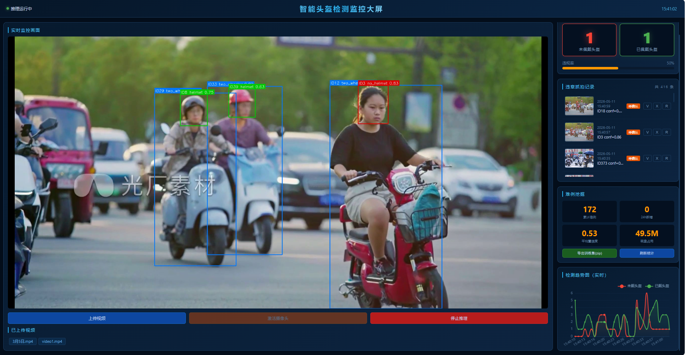
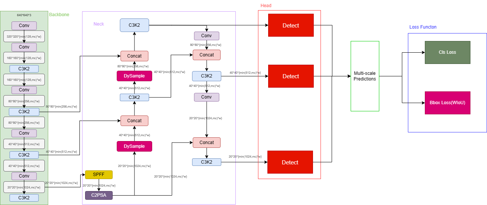

# YOLO-helmet 安全帽检测项目

## 项目简介
本项目是一个基于改进 YOLO11 的安全帽佩戴检测系统。旨在通过计算机视觉与深度学习技术，对施工现场、工厂等作业环境下的工人是否佩戴安全帽进行高精度、实时的健康安全监控，为安全生产提供智能化的技术保障。系统包含了完整的深度学习模型训练代码、后端推理 API、以及可直观查看的可视化界面。

## 运行效果展示

## 改进框架图

